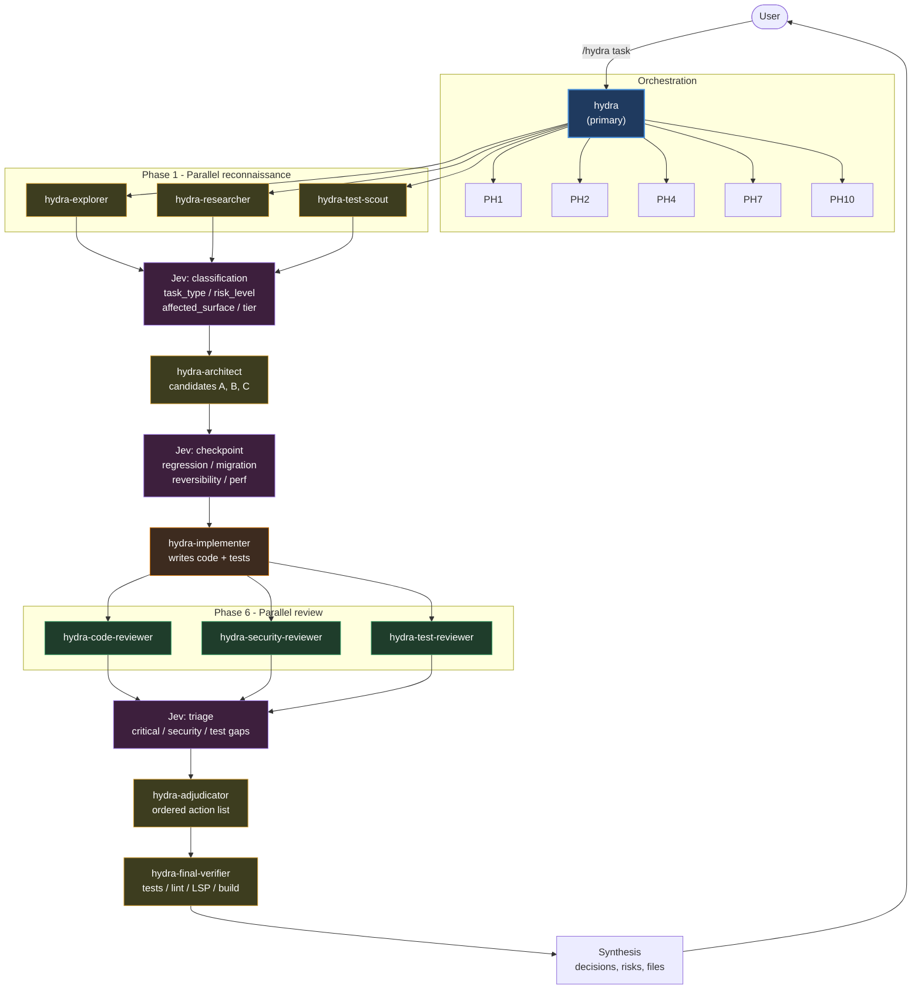
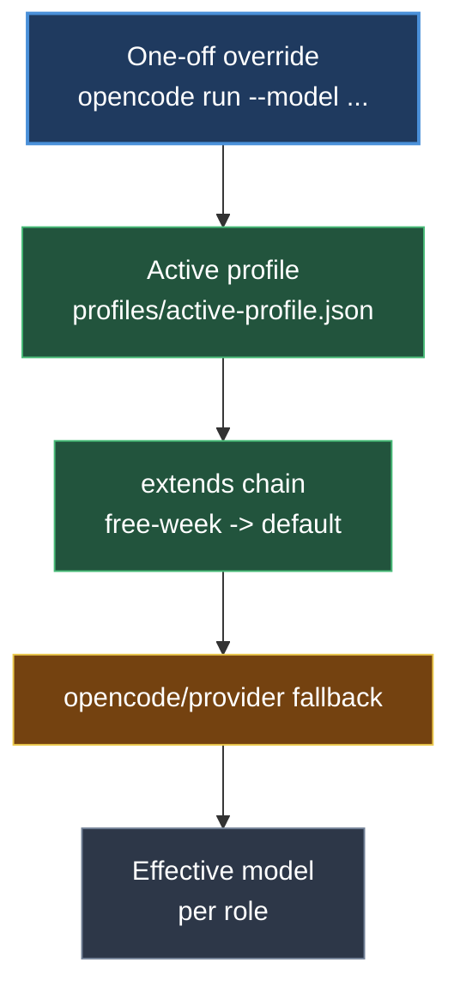

# Hydra Architecture

Hydra is a custom OpenCode workflow for running parallel-orchestrated coding
agents. One primary agent decomposes a coding task into independent workstreams,
fans them out to specialised subagents running on different models, and merges
their results back through review and verification phases.

It lives in this repository as a project-level OpenCode extension:

- Branch: `feat/hydra`
- Entry point: `/hydra <task>`
- Control panel: `/hydra-profile <profile|show|diff>`

---

## Table of contents

1. [Quick start](#quick-start)
2. [The ten-phase workflow](#the-ten-phase-workflow)
3. [Architecture diagram](#architecture-diagram)
4. [Agent roster](#agent-roster)
5. [Model profile system](#model-profile-system)
6. [Model resolution chain](#model-resolution-chain)
7. [Plugin and tools](#plugin-and-tools)
8. [The Jev decision layer](#the-jev-decision-layer)
9. [Permissions and safety](#permissions-and-safety)
10. [File layout](#file-layout)
11. [Operational notes](#operational-notes)
12. [Extending Hydra](#extending-hydra)

---

## Quick start

```bash
# 1. See which models are currently assigned to each role
/hydra-profile show

# 2. Run the swarm on a task
/hydra add a --check mode to the stow playbook

# 3. Switch to a cheaper or free model set before running
/hydra-profile free

# 4. Compare two profiles before choosing
/hydra-profile diff default max-quality

# 5. Go back to the curated production set
/hydra-profile default
```

`/hydra` accepts a free-form task description after the command name. The
orchestrator decides how to decompose it; you do not have to name the
subagents yourself.

---

## The ten-phase workflow

The orchestrator prompt at
`.opencode/agents/workflows/hydra/prompts/orchestrator.md` defines the flow.
Phases marked **parallel** fan out into several subagent invocations at once.

| # | Phase | Agents involved | Parallel | Purpose |
|---|-------|-----------------|----------|---------|
| 1 | Reconnaissance | `hydra-explorer`, `hydra-researcher`, `hydra-test-scout` | yes | Map the codebase, gather conventions, inventory tests |
| 2 | Jev classification | Jev via `hydra_jev` | no | Classify task type, risk level, affected surface, recommended tier |
| 3 | Architecture | `hydra-architect` | no | Produce up to three candidate designs and a recommendation |
| 4 | Jev checkpoint | Jev via `hydra_jev` | no | Score each candidate on risk, surface, reversibility, performance |
| 5 | Implementation | `hydra-implementer` | no | Write the code and tests (the only editing role) |
| 6 | Review | `hydra-code-reviewer`, `hydra-security-reviewer`, `hydra-test-reviewer` | yes | Independent correctness, security, and coverage review |
| 7 | Jev triage | Jev via `hydra_jev` | no | Sort findings into critical, security, and test-gap buckets |
| 8 | Adjudication | `hydra-adjudicator` | no | Resolve reviewer conflicts into an ordered action list |
| 9 | Final verification | `hydra-final-verifier` | no | Run tests, lint, type checks, build — deterministic only |
| 10 | Synthesis | orchestrator | no | Report decisions, risks, and changed files back to the user |

### Why the fan-outs are shaped this way

- **Reconnaissance is parallel** because the three questions are independent:
  *what code exists*, *what rules apply*, and *what tests exist* do not need
  each other's answers.
- **The review fan-out is parallel** because review independence is the point.
  Three reviewers sharing one context would converge on the same blind spots;
  separate invocations do not.
- **Everything else is sequential** because each phase consumes the previous
  one's output. An architect needs the exploration results; an implementer
  needs the design; a verifier needs the code.

---

## Architecture diagram

### Mermaid



### ASCII fallback

```
                          USER
                            |
                    /hydra <task>
                            v
                 +--------------------+
                 |  hydra (primary)   |
                 +--------------------+
                            |
      ============ PHASE 1: RECONNAISSANCE ============
                            |
         +------------------+------------------+
         |                  |                  |
    +---------+      +-----------+      +-----------+
    |explorer |      |researcher |      |test-scout |
    +---------+      +-----------+      +-----------+
         |                  |                  |
         +------------------+------------------+
                            |
             +------------------------------+
             | Jev: classification          |
             | task_type, risk_level,       |
             | affected_surface, tier       |
             +------------------------------+
                            |
      ============ PHASE 3: ARCHITECTURE ============
                            |
                 +---------------------+
                 | hydra-architect     |
                 | candidates A, B, C  |
                 +---------------------+
                            |
             +------------------------------+
             | Jev: checkpoint              |
             | regression, migration,       |
             | reversibility, perf          |
             +------------------------------+
                            |
       ========= PHASE 5: IMPLEMENTATION =========
                            |
              +----------------------------+
              | hydra-implementer          |
              | writes code + tests        |
              +----------------------------+
                            |
       ============ PHASE 6: REVIEW (parallel) ============
                            |
         +------------------+------------------+
         |                  |                  |
    +-----------+     +-------------+    +-----------+
    |code-review|     |security-rev|    |test-review|
    +-----------+     +-------------+    +-----------+
         |                  |                  |
         +------------------+------------------+
                            |
              +----------------------------+
              | Jev: triage                 |
              | critical/security/test-gaps |
              +----------------------------+
                            |
      ========= PHASE 8: ADJUDICATION =========
                            |
              +----------------------------+
              | hydra-adjudicator           |
              | ordered action list         |
              +----------------------------+
                            |
       ======= PHASE 9: FINAL VERIFICATION =======
                            |
              +----------------------------+
              | hydra-final-verifier        |
              | tests / lint / LSP / build  |
              +----------------------------+
                            |
                            v
              +---------------------------+
              | Synthesis                  |
              | decisions, risks, files    |
              +---------------------------+
                            |
                            v
                          USER
```

---

## Agent roster

Every agent is a thin OpenCode agent file under `.opencode/agents/`. Each one
just reads its own prompt file from
`.opencode/agents/workflows/hydra/prompts/` and follows it. That separation is
deliberate: the agent file holds OpenCode metadata (name, mode, permissions),
the prompt file holds the behaviour.

### Entry points

| Agent | Mode | `edit` | `bash` | Responsibility |
|-------|------|--------|--------|----------------|
| `hydra` | primary | allow | ask | Orchestrates all ten phases; the only entry point for a task |
| `hydra-profile` | subagent | deny | deny | Serves `/hydra-profile`; only calls the `hydra_profile` tool |

### Swarm roles

| Agent | Mode | `edit` | `bash` | Responsibility |
|-------|------|--------|--------|----------------|
| `hydra-explorer` | subagent | deny | ask | Maps relevant files, abstractions, dependencies, and risks |
| `hydra-researcher` | subagent | deny | ask | Gathers project conventions, docs, and technology constraints |
| `hydra-test-scout` | subagent | deny | ask | Inventories existing tests and defines the test strategy |
| `hydra-architect` | subagent | deny | ask | Generates candidate designs A/B/C and a recommendation |
| `hydra-implementer` | subagent | **allow** | ask | The only role that writes code and tests |
| `hydra-code-reviewer` | subagent | deny | ask | Correctness, clarity, maintainability review |
| `hydra-security-reviewer` | subagent | deny | ask | Injection, validation, secrets, privilege, dependency risks |
| `hydra-test-reviewer` | subagent | deny | ask | Coverage gaps, edge cases, assertion quality |
| `hydra-adjudicator` | subagent | deny | ask | Resolves reviewer conflicts into an ordered action list |
| `hydra-final-verifier` | subagent | deny | **allow** | Runs tests, lint, type checks, and builds |

---

## Model profile system

### The invariant

> Changing a model must never require changing an agent prompt, the
> orchestration logic, or the Jev client.

Roles are stable; model assignments live in one place and are replaceable. This
matters because the OpenCode Go/Zen catalogue changes: preview models appear,
free tiers expire, and better options ship. With the profile layer, reacting to
that is a one-file edit rather than a hunt through twelve agent files.

### The five profiles

| Profile | Inherits | Intent | Policy highlights |
|---------|----------|--------|------------------|
| `default` | — | Curated quality/cost balance for normal work | paid allowed, preview denied |
| `cheap` | `default` | Reduce spend on exploration and review | paid allowed |
| `free` | **nothing** | Zero-cost development | paid **denied**, every role explicitly listed and verified |
| `max-quality` | `default` | Important or high-risk work | independent review + final verification required |
| `free-week` | `default` | Temporary preview/free experimentation | preview allowed, security downgrade denied |

### Why `free` is not implemented as an override

`free` looks like it could be `default` plus overrides, but that shape has a
dangerous failure mode: a newly added role would silently inherit the paid
default. Instead `free` declares **every role explicitly** and carries a
`verified_free_models` allow-list. The resolver refuses to start the swarm if
any role's model is not on that list, so `free` is a hard cost-control contract
rather than a suggestion.

`free-week` is the opposite case and *does* inherit: it is experimentation
layered over `default`, overriding only the expensive roles so the cheap
exploration roles keep their normal models.

### Profile file shape

```json
{
  "name": "default",
  "description": "Balanced quality/cost production profile.",
  "extends": null,
  "roles": {
    "orchestrator": "opencode/<default-orchestrator-model>",
    "explorer": "opencode/<default-explorer-model>",
    "architect": "opencode/<default-architect-model>",
    "implementer": "opencode/<default-implementer-model>"
  },
  "jev": { "model": "jev-1.13" },
  "policy": {
    "allow_paid_models": true,
    "allow_preview_models": false,
    "require_explicit_free_models": false,
    "verified_free_models": []
  }
}
```

### Model IDs are placeholders right now

Every model slot currently reads like
`opencode/<default-architect-model>` or `opencode/<free-orchestrator-model>`.
These are intentional placeholders, not real model names. Before the first
production run, replace each one with a real ID from:

```bash
opencode models              # all models
opencode models opencode     # one provider
```

For the `free` profile you must add the real free-model IDs to
`verified_free_models` at the same time, or the resolver will refuse the
profile — which is the intended behaviour.

### Optional capability tiers

A profile may map capability tiers to models instead of pinning every role
directly:

```json
{
  "tiers": {
    "reasoning-heavy": "opencode/<qwen-max-model>",
    "coding-heavy": "opencode/<kimi-code-model>",
    "review-efficient": "opencode/<glm-flash-model>",
    "cheap-general": "opencode/<mimo-flash-model>"
  },
  "roles": {
    "architect": "reasoning-heavy",
    "implementer": "coding-heavy",
    "code-reviewer": "review-efficient",
    "explorer": "cheap-general"
  }
}
```

A child profile can then remap a tier with `tier_overrides` and move every role
bound to it in one edit. The resolver supports both forms: a role value is
treated as a tier name if it matches a key in `tiers`, otherwise it is used as a
model ID directly.

---

## Model resolution chain

### Mermaid



### ASCII fallback

```
   explicit one-off override        opencode run --model opencode/xxx
              |
              v
   active swarm profile             profiles/active-profile.json
              |
              v
   extends chain                    free-week -> default -> null
              |
              v
   opencode/provider fallback       whatever the session would use
              |
              v
   effective model for each role
```

### Inheritance rules

```text
effective_model(role):
    if active_profile.overrides[role] exists:
        return active_profile.overrides[role]
    return parent_profile.roles[role]
```

Merging is field-wise, not wholesale:

| Field | Merge behaviour |
|-------|-----------------|
| `roles` | shallow merge — child keys win, parent keys survive |
| `tiers` | shallow merge, then `tier_overrides` applied on top |
| `policy` | shallow merge — a child can relax one flag without restating the rest |
| `jev` | shallow merge — the model is independently configurable per profile |

---

## Plugin and tools

`.opencode/plugins/hydra.js` is registered in `.opencode/opencode.json` next to
the existing graphify plugin. It does three things.

### 1. Injects models at startup

The `config` hook receives the live merged config, runs
`resolve_profile.py --active`, and writes the resolved model into every Hydra
agent:

```js
cfg.agent.hydra.model = resolved.models.orchestrator;
cfg.agent["hydra-architect"].model = resolved.models.architect;
// ... and so on for all eleven roles
```

If resolution fails, the plugin logs the reason and leaves OpenCode's defaults
in place rather than blocking startup.

### 2. Manages profiles at runtime

The `hydra_profile` tool writes `active-profile.json` and re-applies the
resolved models to the live config object, so a switch can take effect without
restarting.

### 3. Exposes Jev to the swarm

The `hydra_jev` tool shells out to `scripts/jev.py`, which handles
authentication, batching, and the placeholder fallback.

### Tool reference

| Tool | Arguments | Returns |
|------|-----------|---------|
| `hydra_profile` | `action` (`set` \| `show` \| `diff`), `profile`, `other` | Human-readable role→model table or diff |
| `hydra_resolve` | none | Effective profile as JSON, including policy and Jev model |
| `hydra_jev` | `questions` (object of name → question text) | Structured answers per question |

---

## The Jev decision layer

Jev sits beside the swarm as a **decision accelerator**, not as ground truth.
It answers typed questions in batches and returns structured values with
confidence, which the orchestrator and individual agents reason over.

### Evidence precedence

```text
hard facts (tests, compiler, LSP)
        >
agent reasoning
        >
Jev heuristic classification
```

Tests, compiler output, and LSP results outrank reviewer opinions, which
outrank Jev signals. Jev can rank two candidate designs or flag a
concentration of risk, but it cannot overrule a failing test.

### Where Jev is called

| Phase | Question batch |
|-------|----------------|
| 2 — Classification | `task_type`, `risk_level`, `affected_surface`, `recommended_tier` |
| 4 — Architecture checkpoint | `best_candidate`, `regression_risk`, `migration_risk`, `change_surface`, `reversibility`, `performance_risk`, `needs_deeper_review` |
| 5 — Implementer micro-decisions | modify existing helper vs. introduce a new one, unrelated-caller risk, extra test needed, escalate to architect |
| 7 — Review triage | `critical_issues`, `security_concerns`, `test_gaps` |

Batching matters: Jev evaluates multiple questions in a single request in
parallel, so one call per phase is far cheaper than six sequential calls.

### Credentials

Jev reads its endpoint and token from an env file, not from the profile JSONs:

```bash
cp .opencode/agents/workflows/hydra/.env.example \
   .opencode/agents/workflows/hydra/.env
```

```dotenv
JEV_ENDPOINT=
JEV_API_TOKEN=
```

The `.env` file is gitignored. Until it exists, `jev.py` returns a
deterministic placeholder response per question, so the whole workflow still
runs end to end during development.

---

## Permissions and safety

### The edit/bash matrix

```text
                       edit        bash
                       -------     ---------
hydra                  allow       ask
hydra-implementer      allow       ask
hydra-final-verifier   deny        allow
everything else        deny        ask
hydra-profile          deny        deny
```

The intent is a narrow write surface. Only the orchestrator and the
implementer can modify files; the three reviewers, the architect, and the
adjudicator cannot. The final verifier gets `bash: allow` because it exists
precisely to run test and lint commands, while `edit: deny` keeps it from
"fixing" what it just found. The profile manager has both denied because it only
calls the `hydra_profile` tool.

### Policy flags

| Flag | Effect |
|------|--------|
| `allow_paid_models` | When `false`, every role model must appear in `verified_free_models` |
| `allow_preview_models` | When `false`, any model whose name contains `preview` is rejected |
| `require_explicit_free_models` | Marks the profile as a hard zero-cost contract |
| `fail_if_model_is_not_verified_free` | Refuse to resolve rather than warn |
| `require_independent_review` | The review fan-out is mandatory, not optional |
| `require_final_verification` | Phase 9 must run before synthesis |
| `allow_security_downgrade` | Keep `false` to prevent a preview experiment from displacing the security reviewer |

---

## File layout

```text
<opencode-config>/   # e.g. ./.opencode/ or ~/.config/opencode/
├── opencode.json                       # registers graphify.js + hydra.js
├── agents/
│   ├── hydra.md                        # primary orchestrator
│   ├── hydra-profile.md                # /hydra-profile handler
│   ├── hydra-explorer.md               # role stubs (metadata only)
│   ├── hydra-researcher.md
│   ├── hydra-test-scout.md
│   ├── hydra-architect.md
│   ├── hydra-implementer.md
│   ├── hydra-code-reviewer.md
│   ├── hydra-security-reviewer.md
│   ├── hydra-test-reviewer.md
│   ├── hydra-adjudicator.md
│   ├── hydra-final-verifier.md
│   └── workflows/
│       ├── README.md                   # convention for new workflows
│       └── hydra/
│           ├── README.md               # workflow folder guide
│           ├── .env.example            # Jev credentials template
│           ├── .gitignore              # ignores .env
│           ├── profiles/
│           │   ├── active-profile.json # currently "default"
│           │   ├── default.json
│           │   ├── cheap.json
│           │   ├── free.json
│           │   ├── max-quality.json
│           │   └── free-week.json
│           ├── prompts/
│           │   ├── orchestrator.md      # the ten-phase flow
│           │   ├── explorer.md
│           │   ├── researcher.md
│           │   ├── test-scout.md
│           │   ├── architect.md
│           │   ├── implementer.md
│           │   ├── code-reviewer.md
│           │   ├── security-reviewer.md
│           │   ├── test-reviewer.md
│           │   ├── adjudicator.md
│           │   └── final-verifier.md
│           └── scripts/
│               ├── resolve_profile.py  # inheritance + policy validation
│               └── jev.py              # Jev client + placeholder fallback
├── commands/
│   ├── hydra.md                        # /hydra <task>
│   └── hydra-profile.md                # /hydra-profile <profile|show|diff>
└── plugins/
    ├── graphify.js
    └── hydra.js
```

### Useful manual commands

The resolver works standalone, which is useful for debugging a profile without
starting a swarm:

```bash
python3 .opencode/agents/workflows/hydra/scripts/resolve_profile.py --active
python3 .opencode/agents/workflows/hydra/scripts/resolve_profile.py --show free
python3 .opencode/agents/workflows/hydra/scripts/resolve_profile.py --diff default free-week
python3 .opencode/agents/workflows/hydra/scripts/jev.py \
  --questions '{"task_type":"feature or bugfix?","risk_level":"low/medium/high?"}'
```

---

## Operational notes

- **OpenCode loads config once at startup.** Agents, commands, plugins, and
  profiles are read when the process starts and are not hot-reloaded. Restart
  OpenCode after changing anything under `.opencode/`.
- **Profile switching is normally live.** `hydra_profile` re-applies models to
  the running config object. If a switch does not take effect mid-session,
  restart OpenCode.
- **A placeholder model ID will not resolve.** Until the profile JSONs hold real
  IDs, `/hydra` will fail when it tries to spawn a subagent. Fill in the models
  before the first real run.
- **`free` fails loudly by design.** If a role's model is not in
  `verified_free_models`, the resolver exits non-zero and no agents start.
- **`graphify-out/` is gitignored**, so the knowledge graph is per-machine.

---

## Extending Hydra

### Add a role

1. Create `.opencode/agents/hydra-<role>.md` with the metadata frontmatter.
2. Create the matching prompt in `.opencode/agents/workflows/hydra/prompts/`.
3. Add the role to the `ROLES` array in `.opencode/plugins/hydra.js`.
4. Add the role to **every** profile's `roles` map. The resolver fails on a
   missing role, which is what stops a new role from silently inheriting a paid
   model in the `free` profile.
5. Reference the new role from `prompts/orchestrator.md`.

### Add a profile

1. Create `profiles/<name>.json`.
2. Decide whether it inherits: use `extends: "default"` for a variation, or
   `extends: null` with an explicit `roles` map when you need a hard guarantee.
3. Validate before activating:
   ```bash
   python3 .opencode/agents/workflows/hydra/scripts/resolve_profile.py --show <name>
   ```
4. Activate it with `/hydra-profile <name>`.

### Add a whole new workflow

Create a sibling folder under `.opencode/agents/workflows/<name>/` with its own
`prompts/`, `profiles/`, and `scripts/`, plus a primary-agent stub at
`.opencode/agents/<name>.md`. See
`.opencode/agents/workflows/README.md` for the convention.