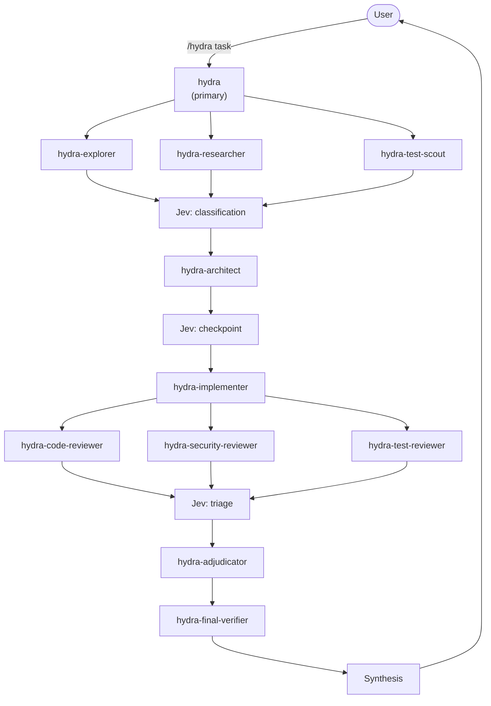

# OpenCode Hydra

A standalone, installable OpenCode workflow for parallel-orchestrated coding
agents. One primary agent decomposes a task, fans it out to specialised
subagents running on different models, and merges the results through review
and verification phases.

- **Repository:** `/home/tanque/projects/stable/code/opencode-hydra/`
- **Resources:** `/home/tanque/projects/stable/resources/opencode-hydra/`
- **Entry point:** `/hydra <task>`
- **Control panel:** `/hydra-profile <profile|show|diff>`

---

## Quick install

```bash
git clone https://github.com/TheShooter89/hydra-architect && cd hydra-architect && ./install.sh .
```

This installs Hydra into the current project's `.opencode/`. To install it
globally into `~/.config/opencode/` so it is available in every project:

```bash
git clone https://github.com/TheShooter89/hydra-architect && cd hydra-architect && ./install.sh --global
```

Restart OpenCode when the install finishes.

---

## Table of contents

1. [Installation](#installation)
2. [Quick start](#quick-start)
3. [Model profiles](#model-profiles)
4. [Jev credentials](#jev-credentials)
5. [Architecture overview](#architecture-overview)
6. [Updating the plugin dependency](#updating-the-plugin-dependency)
7. [Uninstallation](#uninstallation)
8. [Development](#development)

---

## Installation

The installer copies agents, commands, the plugin, and the workflow assets into
an OpenCode config directory. It never touches a target project's root
`package.json`; the npm dependency is installed inside the OpenCode directory
itself.

The quickest route is the one-liner in [Quick install](#quick-install) above.
The commands below assume you have already cloned the repository.

### Install into the current project

```bash
./install.sh .
# or
make install
```

This puts Hydra into `./.opencode/`.

### Install globally

```bash
./install.sh --global
# or
make install-global
```

This puts Hydra into `~/.config/opencode/` so it is available in every project.

### Install into an explicit path

```bash
./install.sh --target /path/to/project
```

This puts Hydra into `/path/to/project/.opencode/`.

### Clone over SSH instead

If you prefer key-based authentication, clone with
`git@github.com:TheShooter89/hydra-architect.git`. Everything after the clone is
identical.

### Overwriting an existing install

By default the installer asks before overwriting. To force:

```bash
./install.sh --force .
./install.sh --force --global
./install.sh --force --target /path/to/project
```

### What the installer does

1. Copies `hydra/agents/*` into the target `agents/` directory.
2. Copies `hydra/commands/*` into the target `commands/` directory.
3. Copies `hydra/plugins/hydra.js` into the target `plugins/` directory.
4. Copies `hydra/workflows/hydra/` into the target `agents/workflows/hydra/`
   directory.
5. Runs `npm install @opencode-ai/plugin` inside the target OpenCode
   directory, keeping `node_modules` and `package.json` self-contained there.
6. Registers `.opencode/plugins/hydra.js` in the target `opencode.json`.
7. Ensures npm artifacts are gitignored inside the OpenCode directory.

Restart OpenCode after installation.

---

## Quick start

```text
# See the active profile and assigned models
/hydra-profile show

# Run the swarm
/hydra add a --check flag to the stow playbook

# Switch model profile
/hydra-profile free

# Compare two profiles
/hydra-profile diff default max-quality
```

---

## Model profiles

Profiles live in the installed workflow's `profiles/` folder:

| Profile | Inherits | Intent |
|---------|----------|--------|
| `default` | — | Curated quality/cost balance |
| `cheap` | `default` | Reduce spend on exploration/review |
| `free` | **nothing** | Hard zero-cost contract; every role must be explicitly verified free |
| `max-quality` | `default` | Strongest models for important or risky work |
| `free-week` | `default` | Temporary preview/free experimentation |

Model IDs are placeholders right now. Replace them with real IDs from:

```bash
opencode models
```

For the `free` profile, also update `verified_free_models` or the resolver will
refuse to run.

---

## Jev credentials

Copy the example env file in the installed workflow folder and fill it in:

```bash
cp .opencode/agents/workflows/hydra/.env.example \
   .opencode/agents/workflows/hydra/.env
```

```dotenv
JEV_ENDPOINT=
JEV_API_TOKEN=
```

The `.env` file is gitignored. Until credentials are present, `jev.py` returns a
deterministic placeholder response so the workflow can still be tested.

---

## Architecture overview

Hydra runs ten phases. Reconnaissance and review fan out in parallel; the rest
are sequential.



Evidence precedence:

```text
hard facts (tests, compiler, LSP)
        >
agent reasoning
        >
Jev heuristic classification
```

See `ARCHITECTURE.md` for the full description, ASCII fallback diagrams, and
agent permission matrix.

---

## Updating the plugin dependency

Because the plugin dependency is installed locally inside the target OpenCode
directory, you can update it per target:

```bash
npm update @opencode-ai/plugin --prefix ~/.config/opencode
# or for a project install
npm update @opencode-ai/plugin --prefix ./.opencode
```

To update the version that new installs will use, change the version in the
installer or run:

```bash
npm install @opencode-ai-plugin@latest --prefix ./.opencode
```

The Hydra repo itself does not vendor the plugin, so there is no vendored copy
to keep in sync.

---

## Uninstallation

```bash
./uninstall.sh .
./uninstall.sh --global
./uninstall.sh --target /path/to/project
./uninstall.sh --force .
```

This removes Hydra's agents, commands, plugin, workflow folder, and unregisters
the plugin from `opencode.json`. It leaves npm artifacts (`node_modules`,
`package.json`) behind in case other OpenCode plugins share them.

---

## Development

### Project layout

```text
opencode-hydra/
├── README.md
├── ARCHITECTURE.md
├── Makefile
├── install.sh
├── uninstall.sh
├── .gitignore
├── _RESOURCES -> /home/tanque/projects/stable/resources/opencode-hydra/
└── hydra/
    ├── agents/
    ├── commands/
    ├── plugins/
    └── workflows/
        └── hydra/
            ├── profiles/
            ├── prompts/
            └── scripts/
```

### Test the installer

```bash
make test-install
```

This installs into `/tmp/opencode-hydra-test` and then uninstalls, verifying
that both scripts run cleanly.

### Adding a role

1. Add `.opencode/agents/hydra-<role>.md` in the source tree.
2. Add `hydra/workflows/hydra/prompts/<role>.md`.
3. Add the role to the `ROLES` array in `hydra/plugins/hydra.js`.
4. Add the role to every profile JSON.
5. Reference the role in `prompts/orchestrator.md`.

### Adding a profile

1. Create `hydra/workflows/hydra/profiles/<name>.json`.
2. Validate it:
   ```bash
   python3 hydra/workflows/hydra/scripts/resolve_profile.py --show <name>
   ```
3. Re-run the installer where you want it.
